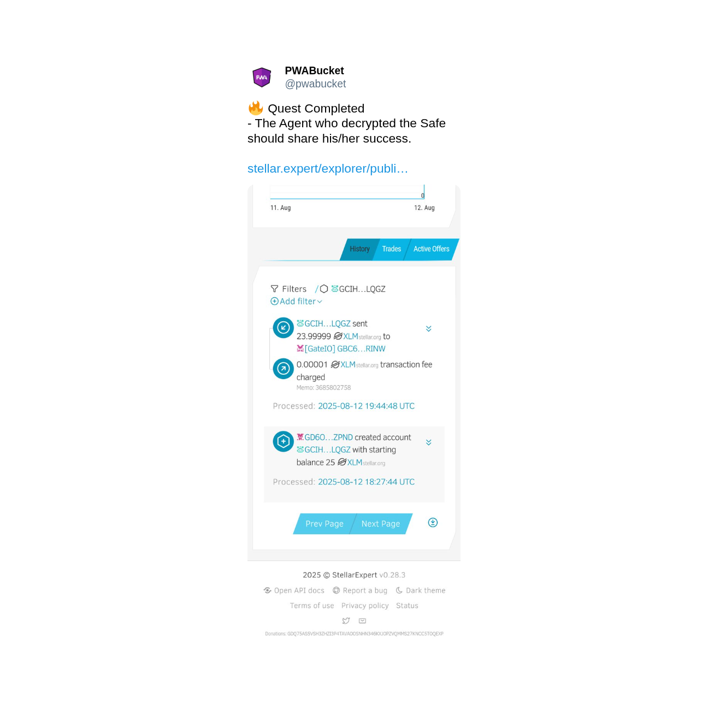

# Quest 01: Stellar Heist (✅ Completed)

  
  

Completion: https://x.com/pwabucket/status/1955355787225641167

**🔐 Mission Briefing**

**Your mission**, should you choose to accept it: **Unlock the encrypted Stellar Wallet** and claim the XLM inside.

We’ve intercepted part of the access code: 7251??

The first **4 digits** are confirmed. The **last 2 digits** remain classified.  
You must recover them by any means necessary.

## Tools at Your Disposal

1. **[Safe](https://safe.pwabucket.com)** – Use to decrypt the encrypted bundle and reveal its contents.  
2. **[Keza](https://keza.pwabucket.com)** – Restore the decrypted data to view the full wallet details (address & secret).  
3. **[Stellar Cargo](https://stellar-cargo.pwabucket.com)** – Import the wallet and access the XLM inside.

---

## 📦 Secure Package Retrieval

Intel confirms the target wallet is contained in this encrypted Safe bundle.  
Acquire it. Study it. Break it open.  
The clock is ticking.

[⬇️ Download the Safe bundle](resources/safe-bundle.zip)

📡 Upon success, transmit your mission report to HQ: [@pwabucket](https://x.com/pwabucket)

---

## Reward
The entire contents of the wallet.

## Deadline
Until someone cracks it.

> 🕵️ *This message will not self-destruct, but the prize won’t wait.*
